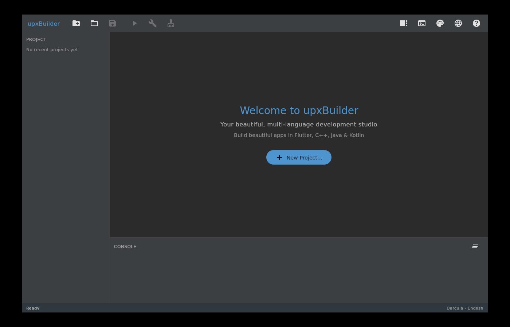
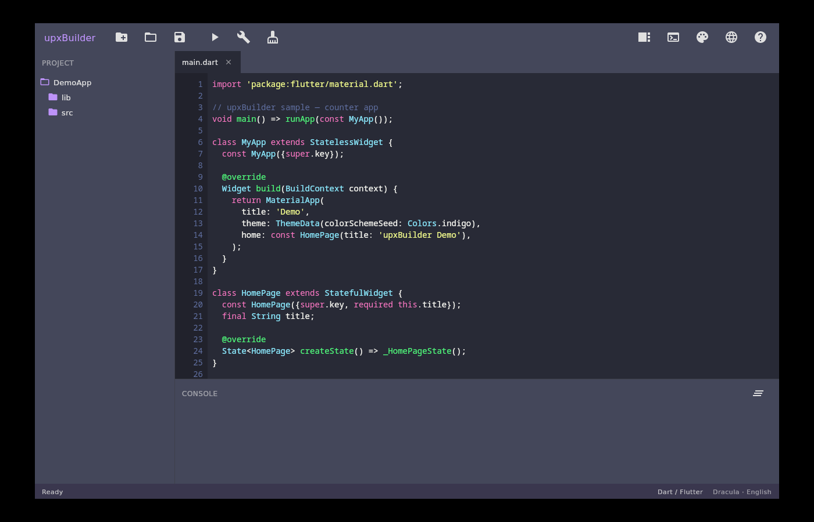

# upxBuilder

A beautiful, multi-language IDE for building apps in **Flutter (Dart)**, **C++**,
**Java** and **Kotlin** — inspired by the look and feel of Android Studio, and
built with **Kotlin** + **Compose Multiplatform for Desktop** (the same JVM
lineage as IntelliJ / Android Studio).




## Features

- **Four languages supported for editing & building** — Dart/Flutter, C++, Java, Kotlin,
  each with its own keyword set and syntax highlighting.
- **10 built-in themes** — Darcula, Midnight Ocean, Dracula, Monokai, Nord,
  Solarized Dark, Synthwave '84, IntelliJ Light, Solarized Light and Sunset.
  Both the UI chrome and the code colours change together.
- **4 UI languages** — English, العربية (Arabic, with full right-to-left layout),
  中文 (Chinese) and Italiano (Italian). Your choice persists between runs.
- **Project templates with built-in coding guides** — create a starter Flutter,
  C++, Java or Kotlin project in one click; each shows a short "how to write code
  in this language" guide.
- **Real build integration** — Run / Build / Clean invoke the actual toolchain
  (`flutter`, `cmake`, `javac`, `gradle`) and stream output to the console. If a
  toolchain is not installed, upxBuilder says so cleanly instead of failing.
- **Android-Studio-style layout** — toolbar, project explorer, editor tabs with
  unsaved-change markers, a line-numbered code editor, a console panel and a
  status bar.

## Requirements

- **JDK 17 or newer** (JDK 21 recommended).
- An internet connection on first build (to download Compose dependencies from
  Maven Central).
- To *build* projects from inside upxBuilder you need the relevant SDK on your
  `PATH`: `flutter`, `cmake`/a C++ compiler, a JDK (`javac`), or `gradle`.
  Editing and highlighting work without any of them.

## Running

```bash
cd upxBuilder
./gradlew run
```

## Packaging a native installer

Compose Desktop can produce a native installer (`.deb`, `.msi` or `.dmg`):

```bash
./gradlew packageDistributionForCurrentOS
```

The result lands in `build/compose/binaries/`.

## Project structure

```
upxBuilder/
├── build.gradle.kts                 # Gradle + Compose Desktop configuration
├── settings.gradle.kts
└── src/main/kotlin/com/upx/builder/
    ├── Main.kt                       # Application entry point / window
    ├── app/AppState.kt               # Central application state
    ├── i18n/Strings.kt               # 4-language translation tables
    ├── theme/Themes.kt               # 10 themes (UI + syntax colours)
    ├── editor/
    │   ├── Language.kt               # Language definitions & keywords
    │   └── SyntaxHighlighter.kt      # Single-pass token highlighter
    ├── project/
    │   ├── ProjectModel.kt           # Project / file-tree / open-file models
    │   ├── Templates.kt              # Starter templates + coding guides
    │   └── BuildRunner.kt            # Invokes the real toolchains
    └── ui/                           # Compose UI: window, panels, dialogs
```

## How highlighting works

`SyntaxHighlighter` is a fast, single-pass tokenizer (not a full parser). It
recognises line/block comments, string and char literals, numbers, annotations,
keywords, types (UpperCamelCase) and call sites, colouring each from the active
theme's `SyntaxPalette`. This keeps editing responsive while still looking like a
real IDE.

## Notes on dependency versions

This project targets **Compose Multiplatform 1.5.11 / Kotlin 1.9.20**, whose full
dependency graph resolves from Maven Central. Newer Compose releases (1.6+/1.7+)
also work but pull some `androidx.lifecycle` artifacts from Google's Maven
repository — keep `google()` in the repositories block if you upgrade.

---

Made as **upxBuilder**.
